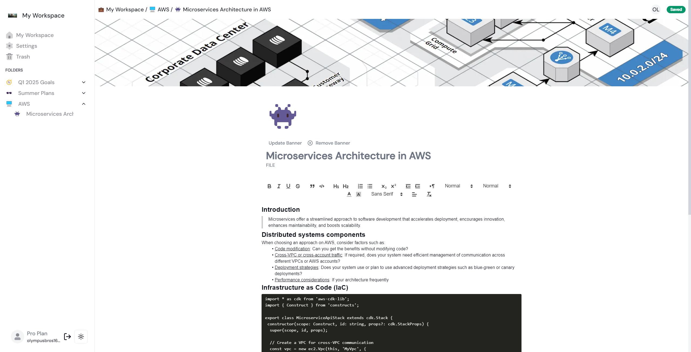

# Hermes: Real-Time Collaborative Workspace

<p align="center">
  
</p>

**Hermes is a cutting-edge SaaS platform that enables seamless, real-time collaboration through a highly responsive and secure environment. Leveraging Next.js, Supabase, and Stripe, it offers live cursor tracking, instant database synchronization, granular access control, and a fully customizable rich text editor.**

## 🚀 Features

- **Real-time Collaboration**: Multiple users can collaborate in real-time, with live cursor tracking and text selection powered by WebSockets.
- **Real-time Database Sync**: Instant data synchronization across sessions using Supabase for consistent and up-to-date views.
- **User Presence Tracking**: Displays online users and editing activity in real-time with Supabase's Presence API.
- **Soft Delete with Trash Bin**: Easily recoverable documents with soft delete functionality, ensuring data isn't lost immediately.
- **Rich Text Editor**: Fully customizable editor supporting headings, lists, tables, and more for a comprehensive editing experience.
- **Light/Dark Mode**: Adaptive UI supporting both light and dark themes.
- **Authentication & 2FA**: Secure user authentication with NextAuth.js and optional email-based two-factor authentication.
- **Access Control with Supabase RLS**: Granular access control using Supabase Row-Level Security policies.

## 🏗️ Tech Stack

| **Technology**     | **Description**                                       |
|--------------------|-------------------------------------------------------|
| **Next.js**        | Full-stack framework with App Router for page routing |
| **Tailwind CSS**   | Utility-first CSS framework for rapid UI development  |
| **Supabase**       | Backend-as-a-service for real-time data and auth      |
| **Stripe**         | Payment processing and subscription management        |
| **Drizzle ORM**    | Type-safe and flexible ORM for database management    |
| **WebSockets**     | Real-time communication between users                 |
| **PostgreSQL**     | Relational database for persistent storage            |

## 🛠️ Setup & Installation
1. Clone the repository
```bash
git clone https://github.com/Echo-Abhinav/Hermes.git
cd hermes
```

2. Install dependencies
```bash
npm install
```
3. Configure Environment Variables Create a .env.local file in the root directory and provide the required environment variables:

```bash
NEXT_PUBLIC_SUPABASE_URL=<your-supabase-url>
NEXT_PUBLIC_SUPABASE_ANON_KEY=<your-supabase-anon-key>
STRIPE_SECRET_KEY=<your-stripe-secret-key>
```

Start the development server

```bash
npm run dev
```
Open http://localhost:3000 to view it in your browser.

